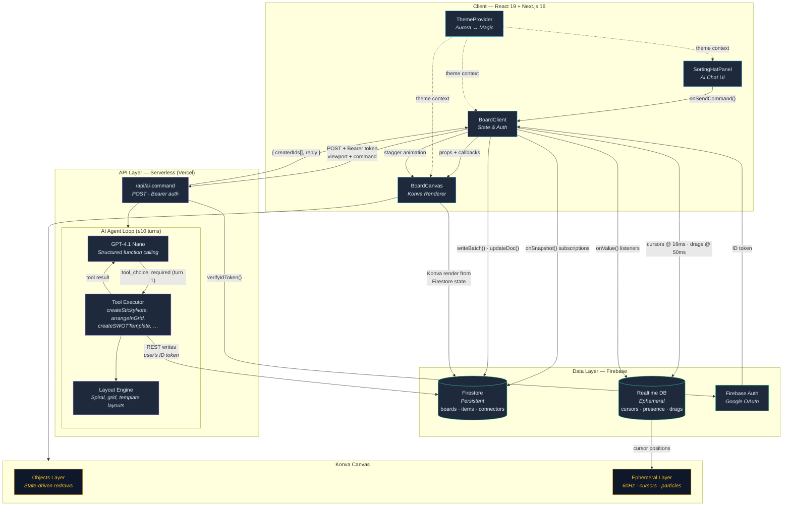

# Collaborative Chaos — Real-Time Collaborative Whiteboard with AI Agent

**Live:** [collaborative-chaos-j7ow.vercel.app](https://collaborative-chaos-j7ow.vercel.app/)
**Repo:** [github.com/helloblair/Collaborative-Chaos](https://github.com/helloblair/Collaborative-Chaos)

A production-scale collaborative whiteboard built with AI-first development methodology. Multiple users can brainstorm, create, and organize content in real-time with an AI agent that manipulates the board through natural language commands. Features a dual-theme system (Aurora and Magic), a chat-based AI panel, undo support, and viewport culling for large boards.

> **Built solo by Kirsten Coronado** — design, architecture, frontend, backend, AI integration, and deployment.

<!-- Screenshot / GIF placeholder — replace with actual recording -->
<!--  -->

## System Architecture



**Why two databases?** Firestore is optimized for persistent, structured data with offline caching and security rules. RTDB is optimized for low-latency pub/sub at 60Hz — cursors, presence, and drag telemetry that doesn't need to survive a page refresh.

**Why two canvas layers?** The objects layer redraws only when board state changes. The ephemeral layer redraws at cursor frequency (60Hz) for cursors, particles, and selection rectangles — without triggering expensive object re-renders.

## Tech Stack

| Layer | Technology |
|-------|-----------|
| Frontend | Next.js 16, React 19, TypeScript, Tailwind v4, react-konva (HTML5 Canvas) |
| Backend | Next.js API Routes (serverless) |
| Database | Firebase Firestore + Firebase Realtime Database |
| Auth | Firebase Auth (Google OAuth) |
| AI | OpenAI GPT-4.1 Nano with function calling (tool use) |
| Deployment | Vercel |

## Key Design Decisions

### Intent vs. Geometry Separation (AI Pipeline)

LLMs are poor at pixel arithmetic. Rather than asking the model to produce coordinates, the server separates *intent* (LLM decides what to create and how to label it) from *geometry* (a deterministic layout engine computes exact pixel coordinates). Template tools receive content as arguments and the server runs `computeContainerChildLayout` to pack stickies inside frames — no layout guesswork left to the model.

The first agentic turn forces `tool_choice: "required"` to prevent text-only responses; subsequent turns use `"auto"`. Conversation history (last 4 messages) travels with each request for multi-turn context. Up to 10 agentic turns per request for complex multi-step commands.

A Firestore reservation document (30-second TTL) prevents concurrent AI commands from colliding, ensuring board state stays coherent during simultaneous multi-user AI use.

### Server Writes Use the User's Firebase ID Token (Not Admin SDK)

The AI route writes to Firestore via the REST API authenticated with the end-user's Firebase ID token — not the Firebase Admin SDK. This means Firestore security rules apply to AI-generated writes exactly as they apply to client writes. The AI cannot create objects on boards the user isn't a member of, by construction.

### Conflict Resolution

- **Object mutations:** Field-level last-write-wins via `updateDoc()`. Only modified fields are written, so concurrent edits to different properties (e.g., position vs. color) don't conflict.
- **Text editing:** Local draft state is maintained during active text input; the Firestore write happens on blur/commit — not on every keystroke.
- **Drag optimization:** Interim positions are broadcast via RTDB during drag for live visual feedback. A single Firestore write persists the final position on `dragEnd`.

### Dual-Theme System

Theme state is persisted to `localStorage` and applied atomically via ~50 CSS custom properties on `document.documentElement`. The Konva canvas receives theme colors as props (`boardBg`, `gridColor`, `cursorStrokeColor`) and re-renders accordingly. A radial `clip-path` reveal animation erupts from the toggle button's exact click coordinates, with the CSS variable swap timed to the animation midpoint.

## Features

- Infinite canvas with smooth pan and zoom
- Sticky notes, shapes (rectangle, circle, line, heart), frames, standalone text, connectors with arrows
- Move, resize, and rotate transforms via Konva Transformer
- Single and multi-select (shift-click, drag-to-select), delete, duplicate, copy/paste
- Undo system (Cmd/Ctrl+Z) supporting create, delete, move, update, and connector operations
- Real-time multiplayer cursors with name labels
- Presence awareness with idle detection — see who's online and who's away
- AI chat panel ("Sorting Hat") with multi-turn conversation, creation, manipulation, layout, and template commands
- Deterministic layout engine for grid, row, column, and template arrangements with auto-populated content
- Auto-wrapping of loose AI-created stickies into labeled frames
- Dual-theme system (Aurora / Magic) with animated transitions and full UI label remapping
- Multi-board dashboard with invite links and board sharing
- Redesigned landing page with product mockup, feature cards, and live board thumbnails
- Offline persistence with graceful disconnect and reconnect
- Viewport culling and React.memo optimizations for 500+ objects
- RTDB security rules and Firestore board membership validation

## Getting Started

1. Clone the repository:
   ```bash
   git clone https://github.com/helloblair/Collaborative-Chaos.git
   cd Collaborative-Chaos/web
   ```

2. Install dependencies:
   ```bash
   npm install
   ```

3. Copy the environment template and fill in your values:
   ```bash
   cp .env.example .env.local
   ```
   See `.env.example` for the full list of required variables.

4. Start the development server:
   ```bash
   npm run dev
   ```

5. Open [http://localhost:3000](http://localhost:3000).

## AI Agent Commands

Open the Sorting Hat panel by clicking the floating action button (bottom-right) or pressing **Cmd+K** / **Ctrl+K**. The panel supports multi-turn conversation — the AI remembers context from earlier messages. Example commands:

- "Add a yellow sticky note that says 'User Research'"
- "Create a SWOT analysis for launching a mobile app"
- "Arrange these sticky notes in a grid"
- "Move all pink sticky notes to the right side"
- "Build a user journey map with 5 stages for an onboarding flow"
- "Set up a retrospective board for our last sprint"

## Deployment

**Production URL:** [collaborative-chaos-j7ow.vercel.app](https://collaborative-chaos-j7ow.vercel.app/)

### Vercel (primary)

1. Push your branch to GitHub.
2. Import the repo in [vercel.com/new](https://vercel.com/new) and set the root directory to `web`.
3. Add the environment variables from `.env.example` in the Vercel dashboard under **Settings > Environment Variables**.
4. Deploy. Vercel auto-detects Next.js and uses the settings in `vercel.json`.

Subsequent pushes to `main` trigger automatic deployments.

```bash
# Or deploy from the CLI
npx vercel --prod
```

### Firebase Hosting (alternative)

Firebase Hosting with the web frameworks preview can serve the Next.js app via Cloud Functions.

```bash
# Install the Firebase CLI if you haven't already
npm install -g firebase-tools

# Log in and select the project
firebase login
firebase use collabboard-chaos

# Set server-side env vars as Firebase config
firebase functions:config:set \
  firebase.project_id="YOUR_PROJECT_ID" \
  firebase.client_email="YOUR_CLIENT_EMAIL" \
  firebase.private_key="YOUR_PRIVATE_KEY" \
  openai.api_key="YOUR_OPENAI_KEY"

# Deploy Firestore rules, RTDB rules, and hosting
firebase deploy
```

### Deploying Firebase Security Rules Only

```bash
firebase deploy --only firestore:rules,database
```

## Performance Targets

| Metric | Target |
|--------|--------|
| Frame rate during pan/zoom/manipulation | 60 FPS |
| Object sync latency | <100ms |
| Cursor sync latency | <50ms (16ms broadcast interval) |
| Object count without degradation | 500+ (viewport culling + React.memo) |
| Concurrent users | 5+ |
